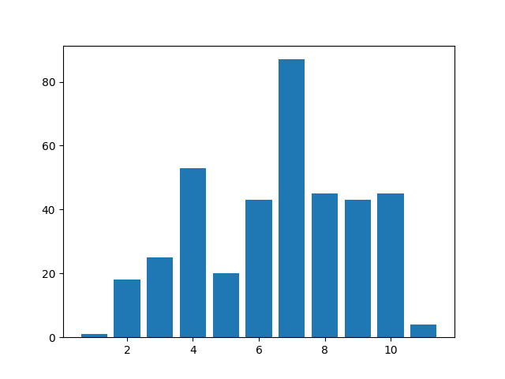

# Diabetes Dataset Notes

- Skimming the UCI references page, it looks like every place that references this is incorrect: using the PIMA dataset instead of the "Diabetes" dataset.

---

## Questions

- How many people are in the "automatic" vs. "paper" pool?

## UCI Description

- Diabetes patient records were either obtained from "an automatic electronic recording device" or "paper records."
- Paper records provided "logical time slots" (breakfast, lunch, dinner, bedtime) which were coded as (08:00, 12:00, 18:00, or 22:00) respectively.

## README

- Originally from the "1994 AAAI Spring Symposium on Artificial Intelligence in Medicine"
- This N=70 set contains stamps for lifestyle

## "Data-Codes"

[One interpretation might be to collapse all of these into representing "an abstract meal" independent of whether it was a breakfast, lunch, dinner, or snack.]

```text
33 = Regular insulin dose                     <-- O 15-45 minutes P 1-3 hours D 4-6 hours
34 = NPH insulin dose                         <-- O 1-3 hours     P 4-6 hours D 10-14 hours
35 = UltraLente insulin dose                  <-- O 2-5 hours     P (N/A)     D 24-30 hours
48 = Unspecified blood glucose measurement    <-- 48 == 57? -- 48 is slightly more common
57 = Unspecified blood glucose measurement    <-- 48 == 57?
58 = Pre-breakfast blood glucose measurement
59 = Post-breakfast blood glucose measurement
60 = Pre-lunch blood glucose measurement
61 = Post-lunch blood glucose measurement
62 = Pre-supper blood glucose measurement
63 = Post-supper blood glucose measurement
64 = Pre-snack blood glucose measurement
65 = Hypoglycemic symptoms                    <-- "When do symptoms occur is probably the target."
66 = Typical meal ingestion
67 = More-than-usual meal ingestion
68 = Less-than-usual meal ingestion
69 = Typical exercise activity
70 = More-than-usual exercise activity
71 = Less-than-usual exercise activity
72 = Unspecified special event                <-- WTF is this?
```

## Other things Alexander found

### Unknown codes

There are codes that exist in the files
that are not present in the "Data Codes"

| Code | (File Numbers where Code is present) |
| :--- | :--- |
| 56 | (03, 04, 05, 11, 12, 17, 18, 19, 22, 23, 25, 32, 33, 34, 35, 36, 43, 44, 49, 50, 51, 52, 57, 69) |
| 4 |  (20) |
| 36 | (22) |
| 0 | (27, 29) |

Educated guesses from looking at the data:

```text
56
    (Probably a glucose measurement of some kind)
    "57" is an unknown glucose measurement, bad data entry?
```

### Corrupted data?

Consider `data-27` lines 802-815.

```text
10-11-1989      12:30   33      004
10-11-1989      19:30   62      072
10-11-1989      19:30   33      006
10-11-1989      23:00   48      127
10-12-1989      7:00    0
        138     33      3A
10-12-1989      7:00    0
        006     33      21
10-12-1989      7:00    0
        016     33      22
10-12-1989      11:30   60      169
10-12-1989      11:30   33      004
10-12-1989      18:00   62      104
10-12-1989      18:00   33      006
```

Based on the day before (1989-10-11) and the day after (1989-10-13),
this user seems to have a fairly regular early reading + dose around
7:00 AM.

```text
10-11-1989	7:30	58	093
10-11-1989	7:30	33	006
10-11-1989	7:30	34	016

10-13-1989	7:00	58	092
10-13-1989	7:00	33	006
10-13-1989	7:00	34	016
```

Which leads me to believe an uncorrupt version should look like:

```text
10-12-1989	7:00	58	138     <-- preserve the 58 / Reading
10-12-1989	7:00	33	006     <-- preserve the 33 / 006
10-12-1989	7:00	34	016     <-- preserve the 34 / 016
```

---

Something similar happened in `data-29` lines 208-213.

```text
05-25-1990	7:00	0
	201	33	3A
05-25-1990	7:00	0
	004	33	21
05-25-1990	7:00	0
	018	33	22
```

Again, it appears this user has a fairly regular morning routine:
check glucose (58), then take a combination of (33) and (34).

```text
05-23-1990	7:00	58	281
05-23-1990	7:00	33	004
05-23-1990	7:00	34	018

05-24-1990	5:00	58	196
05-24-1990	5:00	33	004
05-24-1990	5:00	34	018

<... corrupted data ...>

05-26-1990	7:00	58	178
05-26-1990	7:00	33	004
05-26-1990	7:00	34	018
```

Suggesting that the corrupted data should be repaired as:

```text
05-25-1990	7:00	58	201
05-25-1990	7:00	33	004
05-25-1990	7:00	34	018
```

But after fixing that one, I found another similar one in the same
user (now lines 431-436, but in-place modification distorted the numbers a bit):

```text
07-02-1990	7:00	0
	202	33	3A
07-02-1990	7:00	0
	006	33	21
07-02-1990	7:00	0
	018	33	22
```

This is starting to feel familiar, let's adjust:

```text
07-02-1990	7:00	58       202
07-02-1990	7:00	33       006
07-02-1990	7:00	34       018
```

Oh no, another in the same user and now on lines 635-641:

```text
07-28-1990	7:00	0
	226	33	3A
07-28-1990	7:00	0
	006	33	21
07-28-1990	7:00	0
	018	33	22
```

Well it still seems to follow the same pattern. It seems odd how regular this
is, almost as if the data-entry was corrupted with bad software:

```text
07-28-1990	7:00	58       226
07-28-1990	7:00	33       006
07-28-1990	7:00	34       018
```

Nooooooo. Now on lines 659-664:

```text
08-03-1990	7:00	0
	162	33	3A
08-03-1990	7:00	0
	006	33	21
08-03-1990	7:00	0
	018	33	22
```

Let's keep going:

```text
08-03-1990	7:00	58	162
08-03-1990	7:00	33	006
08-03-1990	7:00	34	018
```

Well, there's another at 827-832, but the time shifts 30 minutes forward this time:

```text
08-27-1990	7:30	0
	212	33	3A
08-27-1990	7:30	0
	006	33	21
08-27-1990	7:30	0
	018	33	22
```

It still seems to track with the earlier trend we noticed:

```text
08-27-1990	7:30	58	212
08-27-1990	7:30	33	006
08-27-1990	7:30	34	018
```

It practically feels like I could have automated this:

```text
09-11-1990	6:30	0
	169	33	3A
09-11-1990	6:30	0
	006	33	21
09-11-1990	6:30	0
	018	33	22
```

Now at 6:30 A.M. though:

```text
09-11-1990	6:30	58       169
09-11-1990	6:30	33       006
09-11-1990	6:30	34       018
```

I might have missed one earlier. Here's (current) lines 527-531:

```text
07-14-1990	7:00	0
	195	33	3A
07-14-1990	7:00	0
	006	33	21
07-14-1990	7:00	0
	018	33	22
```

which is probably:

```text
07-14-1990	7:00	58	195
07-14-1990	7:00	33	006
07-14-1990	7:00	34	018
```

Now 550-555:

```text
07-17-1990	7:00	0
	168	33	3A
07-17-1990	7:00	0
	006	33	21
07-17-1990	7:00	0
	018	33	22
```

which is probably:

```text
07-17-1990	7:00	58	168
07-17-1990	7:00	33	006
07-17-1990	7:00	34	018
```

Big jump down to 1004-1009:

```text
11-08-1990	7:00	0
	217	33	3A
11-08-1990	7:00	0
	006	33	21
11-08-1990	7:00	0
	020	33	22
```

**Big Change**: It appears that somewhere around 1990-09-24, the
pattern for 58/33/34 → ?/6/18 switched to 58/33/34 → ?/6/20,
which probably means one of the insulin doses increased.
(*Can I represent this as an intervention or an action in some way?*)
Probably translating into this:

```text
11-08-1990	7:00	58	217
11-08-1990	7:00	33	006
11-08-1990	7:00	34	020
```

This seems to continue for a while, now lines 1116-1121 read:

```text
11-29-1990	7:00	0
	209	33	3A
11-29-1990	7:00	0
	006	33	21
11-29-1990	7:00	0
	020	33	22
```

which I've turned into:

```text
11-29-1990	7:00	58	209
11-29-1990	7:00	33	006
11-29-1990	7:00	34	020
```

---

`data-20` has one line that looks out of place,
here's a snapshot of lines 88-119:

```text
05-24-1991	06:00	58	182
05-24-1991	06:00	33	004
05-24-1991	06:00	34	024
05-24-1991	11:55	60	184
05-24-1991	11:55	33	006
05-24-1991	18:25	62	106
05-24-1991	18:25	33	009
05-25-1991	10:20	58	262
05-25-1991	10:20	33	006
05-25-1991	10:20	34	024
05-25-1991	12:45	60	232
05-25-1991	12:45	33	006
05-25-1991	17:45	62	125
05-25-1991	17:45	33	011
05-25-1991	23:45	48	046
05-26-1991	06:00	58	092
05-26-1991	06:00	4	0			<--- What is this?
05-26-1991	06:00	34	024
05-26-1991	12:30	33	006
05-26-1991	17:30	62	182
05-26-1991	17:30	33	010
05-27-1991	09:00	58	153
05-27-1991	09:00	33	004
05-27-1991	09:00	34	024
05-27-1991	14:45	60	225
05-27-1991	14:45	33	006
05-27-1991	18:05	62	204
05-27-1991	18:05	33	011
05-27-1991	22:45	48	042
05-28-1991	06:45	58	164
05-28-1991	06:45	33	004
05-28-1991	06:45	34	024
```

It's worth noting that this is another "Breakfast" reading, and
the user seems to be following a regular 58/33/34 like similar
users have followed.

I've adjusted this reading to:

```text
05-26-1991	06:00	33	004
```

### Unclear what quantities represent

In `data-01`, using `33 = Regular insulin dose` as an example, I have no clue what "values" represent.
Looking at a Histogram, the "value" for a regular dose is between 1-11, with "7" being the most
common value.



### Combinations of Insulin types

In `data-05`, the user appears to frequently take a "regular dose" followed immediately by a "NPH" dose a few minutes later.

### Measurement types may be for human-purposes rather than real things

The codes represent "pre-dinner" or "post-dinner," for instance. `data-01` doesn't always record food alongside these.

It seems likely that categorizing them into pre/post mealtime is more for humans to understand the timestamp.
For example, a pre-supper glucose measurement is not always followed by a record for how big a meal was.
Meals may have been skipped.

## "Domain-Description"

### Intro

"Patients with Insulin Dependent Diabetes Mellitus (IDDM) are insulin deficient. This can either be due to

1. low or absent production of insulin by the beta islet cells of the pancreas subsequent to an auto-immune attack.
2. insulin-resistence, typically associated with older age and obesity, which leads to relative insulin-deficiency even though the insulin levels might be normal.

The "lack of adequate insulin" effect has multiple metabolic effects. However, once a patient is diagnosed and is
receiving regularly scheduled ... insulin, the principal metabolic effect of concern is "the potential for hyperglycemia"
(high blood glucose).

- Chronic hyperglycemia over a period of several years puts a patient at risk for several kinds of micro and macrovascular problems (e.g. retinopathy).
- The goal of therapy for IDDM is to "bring the average blood glucose as close to the normal range as possible."
- Current therapy [c. 1994] makes this goal challenging (and often frustrating) for most patients.
- Due to the inevitable variation in blood glucose (BG) around the mean, a lower mean will result in a higher frequency of unpleasant and sometimes dangerous low BG levels.

[Alexander observations about insulin]

- A combination of insulin doses seems to exist.
  - e.g. data-01: usually takes Regular followed by NPH

- NPH (https://en.wikipedia.org/wiki/NPH_insulin): Effect usually occurs in 90 minutes and can last for 24 hours.

### Outpatient management

[Can we treat this as a causal dataset since there are interventions?]
[Do we assume there's a common cause for hyperglycemia across all patients?]

Three main interventions:

1. Diet
2. Exercise
3. Exogenous insulin

#### Insulin

Insulin:

- Increases the uptake of glucose in many parts of tissues
- Reduces the concentration of glucose in the blood

- Patients with IDDM administer administer insulin via injection.
- Insulin doses are given one or more times a day, typically before meals and sometimes at bedtime.

Goal of insulin regimens are "to have the peak insulin action coincide with the peak rise in BG during meals."

- A combination of several preparations of insulin may be administered.
- Each "formulation" has a:
  - (O) characteristic time of onset of effect
  - (P) time of peak action
  - (D) effective duration
- Each of these times can be significantly affected by site of injection, human vs. animal extract, etc.

The times listed here are estimates [It's emphasized that these are only estimates and may vary, different endocrinologists might have different estimates].

```
33 = Regular insulin dose                     <-- O 15-45 minutes P 1-3 hours D 4-6 hours
34 = NPH insulin dose                         <-- O 1-3 hours     P 4-6 hours D 10-14 hours
35 = UltraLente insulin dose                  <-- O 2-5 hours     P (N/A)     D 24-30 hours
```

#### Exercise

Seems to have multiple effects on BG control.

- BG can fall during exercise, and sometimes for a few hours afterrwards.
- e.g. strenuous exercise in mid-afternoon -> lower BG after dinner.
- e.g. too strenuous exercise coupled with mild dehydration -> increase in BG.

[I wonder if I can extract rules for each of these, it would be interesting if the probabilitiy of these occuring or not is indeed higher.]

```
69 = Typical exercise activity
70 = More-than-usual exercise activity
71 = Less-than-usual exercise activity
```

#### Diet

[I could recode this as a factor where diet is in low-medium-high. How much did the person eat and did they take the proper dose of insulin corresponding to what they planned.]

- Larger meals typically lead to longer and higher elevation of BG.
- Kind of food has an effect
- Missing a meal or eating a smaller meal puts the patient at risk for low BG following the meal.

```
66 = Typical meal ingestion
67 = More-than-usual meal ingestion
68 = Less-than-usual meal ingestion
```

#### Glucose

- BG varies by patient.
    - Normal pre-meal BG is typically 80-120 mg/dl
    - "Target range for an individual with diabetes mellitus is very controvercial."
    - It would be desirable to keep 90% of all BG < 200 mg/dl
    - ...                           average BG < 150 mg/dl
    - Conversely, an average BG > 200 (over several years) is associated with poor outcomes.

Hypoglycemic (low BG) symptoms fall into two cases.

1. Between 40-80 mg/dl. The symptoms are unpleasant and usually obvious to the patient.
2. < 40 mg/dl. The symptoms become quite severe here as the brain is inadequately supplied with glucose.

## "The Files"

Here's the first five lines of the `data-01` file as an example:

```data
MM-DD-YYYY     HH:MM    Code    Value
04-21-1991      9:09    58      100
04-21-1991      9:09    33      009
04-21-1991      9:09    34      013
04-21-1991      17:08   62      119
04-21-1991      17:08   33      007
```
